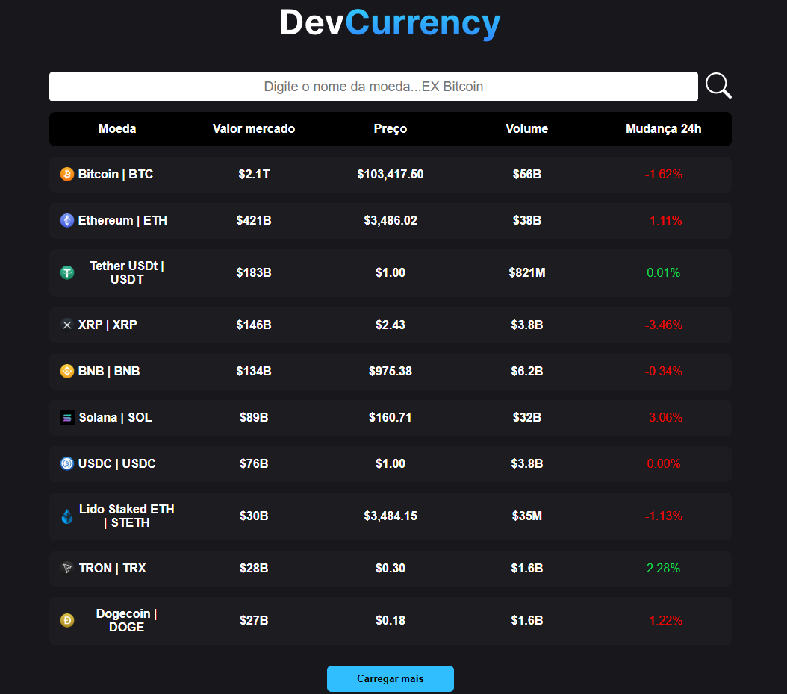
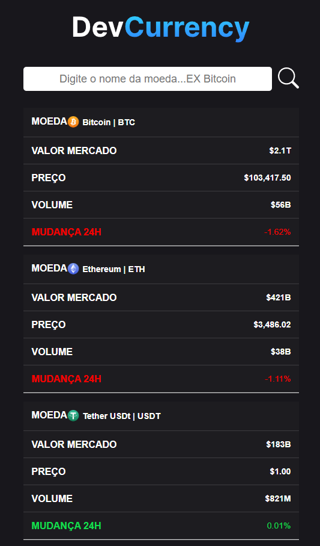
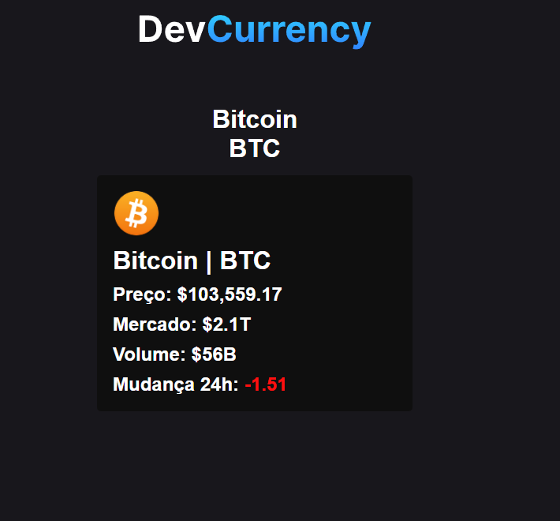

# 🧑‍💻CryptoCoin

## 📖 Sobre:

Este projeto é uma aplicação web baseada em **React** que fornece aos usuários informações sobre diversas criptomoedas. Ele permite que o usuário navegue por uma lista de moedas, pesquise moedas específicas e visualize detalhes como **preço**, **capitalização de mercado** e **volume**. A aplicação utiliza a **API CoinCap** para obter os dados das criptomoedas e o **`react-router-dom`** para navegação. Também incorpora o **`react-toastify`** para fornecer notificações mais amigáveis ao usuário.

## 🚀 Principais Funcionalidades

- **Consumo de Dados:** busca e exibe informaçõe diretamente da API CoinCap.
- **Detalhes das moedas:** mostra informações detalhadas de cada criptomoeda, como preço, capitalização de mercado e volume.
- **Funcionalidade de busca:** permite ao usuário encontrar rapidamente uma criptomoeda específica.
- **Roteamento dinâmico:** utiliza `react-router-dom` para navegar entre as páginas — incluindo página inicial, página de detalhes e página de erro.
- **Notificações ao usuário:** implementa `react-toastify` para exibir notificações, como mensagens de erro em pesquisas inválidas.
- **Layout consistente:** usa um componente de layout para manter a mesma estrutura em todas as páginas.
- **Tratamento de erros:** implementa estratégias para lidar com falhas de requisição da API e rotas inválidas.
- **Paginação:** possui sistema de paginação para lidar com grandes volumes de dados de criptomoedas.

## 🛠️ Tecnologias Utilizadas

- **Frontend:**

  - **React** — biblioteca JavaScript para criação de interfaces de usuário.
  - **React Router DOM** — para roteamento e navegação.
  - **React Icons** — para inclusão de ícones.
  - **React Toastify** — para exibir notificações.

- **Ferramenta de build:**

  - **Vite** — ferramenta de build moderna para empacotar, transformar e servir código front-end.

- **Linguagens:**

  - **TypeScript** — superset do JavaScript que adiciona tipagem estática.
  - **CSS Modules** — para estilização modular dos componentes.

- **Outros:**
  - **ESLint** — para padronização e verificação de código JavaScript/TypeScript.
  - **CoinCap API** — API externa para buscar dados sobre criptomoedas.

## 📦 Como Começar / Instruções de Configuração

### Pré-requisitos

- **Node.js** (versão >= 18)
- **npm** ou **yarn** instalado

### Instalação

1. Clone o repositório:

```bash
git clone https://github.com/Kaua26323/CryptoCoin
cd cryptocoin
```

2. Instale as dependências:

```bash
npm install # ou yarn install
```

### Executando localmente

1. Inicie o servidor de desenvolvimento:

```bash
npm run dev # ou yarn dev
```

Isso iniciará o servidor Vite, normalmente em `http://localhost:5174`.

## 💻 Uso

Após o servidor estar em execução, acesse a aplicação no seu navegador.

- **Página Inicial:** exibe uma lista de criptomoedas com informações básicas.
- **Página de Detalhes:** clique em uma moeda para ver informações detalhadas.
- **Busca:** utilize a barra de pesquisa para encontrar uma criptomoeda específica.

## 📂 Estrutura do Projeto

```
cryptocoin/
├── src/
│   ├── components/
│   │   ├── Header/
│   │   │   ├── index.tsx
│   │   │   ├── header.module.css
│   │   ├── layout/
│   │   │   ├── index.tsx
│   ├── pages/
│   │   ├── Details/
│   │   │   ├── index.tsx
│   │   │   ├── details.module.css
│   │   ├── Erro/
│   │   │   ├── index.tsx
│   │   │   ├── error.module.css
│   │   ├── Home/
│   │   │   ├── index.tsx
│   │   │   ├── home.module.css
│   ├── assets/
│   │   ├── logo.svg
│   ├── App.tsx
│   ├── main.tsx
│   ├── router.tsx
│   ├── index.css
├── vite.config.ts
├── tsconfig.json
├── tsconfig.node.json
├── tsconfig.app.json
├── package.json
├── README.md
```

## 📸 Prévia do projeto





---

📅 Projeto criado para estudos e prática pessoal
